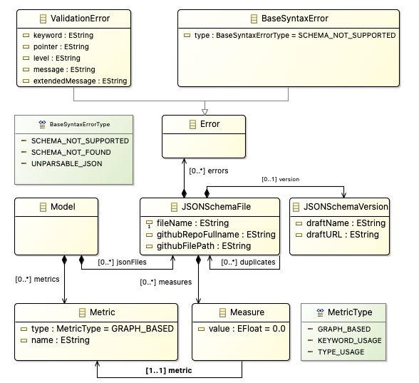

# Json Schema Toolkit

JSON schema toolkit is a set of tools dedicated to the analysis of [JSON Schema documents](https://json-schema.org/).  
The toolkit has been implemented in Java and it can be used twofold: in a stand-alone mode or as a library to manage and analyze JSON schema.  

## Services
**json-schema-toolkit**  provides  many  useful  services  to  deal with  JSON  schema  artifacts.  In  particular,  it  simplifies  the developer  life  by  abstracting  the  managing  operations  (e.g.,validation  and  analysis)  from  the  specific  draft  version.
In particular the following services has been provided for JSONschema  artifacts  conform  to  any  proposed  draft  (i.e.,  Drafts03, 04, 06, 07, and 2019-09 are supported).  

* *Validation Service* validates a JSON schema and returns a list of validation errors if they occur.
* *Metric Service* computes  dynamic  and  static metrics.  Given  a  valid  JSON  schema,  it  computes  type-based, keyword based, and graph based metrics;
* *Keywords Extractor Service* extracts  the  list  of syntactic terms of a JSON schema;
* *CSV Writer Service* exports   the   results   of   the Validation Service and Metrics Service, and Keywords Extractor Service as CSV files;
* *EMF Service* provides  a  set  of  dedicated  EMF-basedJava  APIs  for  loading,  serializing,  validating,  and  query EMF-based   models   conforming   to   the   data   structure metamodel show in Data extraction metamodel section.

## Standalone
Given  a  folder  consisting  of  JSON  files,  the  stand-alone mode validates and analyzes each file according to the following workflow:  

1. Duplicates removal
2. Parsing
3. Validation and errors reporting on a CSV file
4. Metrics calculation and reporting on a CSV file
5. Export of the outcome of this process in the form of a  model that conform to the data extraction metamodel section.

### Tutorial
Once  downloaded this project, open your terminal, and go to the *tools/jsonschemavalidator* folder.  
In this folder you can find the `config.properties` file, with the default configuration.  

#### Configuration
The `config.properties` file has the following configuration properties: 
  
`input.json.schema.path=../../dataset/RAW_SCHEMA/`  
`output.csv.file=test.csv`  
`model.file=model.xmi`  
`remove.dupicates=false`  
`gram.output.folder=gram/`   

Note the default dataset to be analyzed is in this same repository under the folder `dataset/RAW_SCHEMA`.    
The user can modify these properties accordingly to his needs.

#### Launch the application
In the same *tools/jsonschemavalidator* folder, type `./mvnw spring-boot:run` and press return.  
The application will give a set of options.

 *  [V] Validate a json file or a directory of json files
 *  [M] Calculate the metrics of a json file or a directory of json files
 *  [G] Calculate unigrams and bigrams
 *	[EMF] Generate EMF model
 *	[L] Load an EMF model

With every option the user will be asked if `you want to use the default input and output?`.  
If you choose `Y` the configuration in `config.properties` file will be used (recommended), otherwise the user will be asked for the parameters via terminal.   

The `EMF` option will launch all the process.

## Dataset

By default the files under the `dataset/RAW_SCHEMA` folder will be analyzed.  
The outcome of the analysis will be stored in the folder `dataset/ANALYSIS`: the file `ValidationOutput.xlsx` and the file `Metrics.csv`.   
In this folder you can already find the outcome of the analysis already done for the files in `dataset/RAW_SCHEMA`.  
In the column `VALIDATOR_OUTCOME` of `ValidationOutput.xlsx` the following values can be found:  

 * JSON PARSE EXCEPTION for json files not well formed.  
 * UNSUPPORTED SCHEMA for json schema specifying a not supported metaschema.     
 * SCHEMA FIELD NOT FOUND for json that does not specify the metaschema (i.e.,$schema key missing).  
 * The metaschema's keyword that has been violated.  
 * VALID for json schema valid accordingly to the specified metaschema.  
 
Note that the validator does not stop at the first violation, so an invalid file has as many rows as the number of errors found in it.    
The valid JSON schema documents are copied in the folder `dataset/VALID_SCHEMA`, and it will be used to calculate the metrics, that are then exported in the `Metrics.csv` file.

##Data extraction metamodel

